## Chapter III

В качестве результата работы по первым двум задачам должен быть предоставлен отчет.
В каждой части задания указано, что должно быть помещено в отчёт, после её выполнения.
Это могут быть ответы на вопросы, скриншоты и т.д.

В качестве результата работы по третьей задаче должны быть предоставлены исходные файлы для запуска веб-сервера.

В качестве результата работы по четвёртой и пятой задачам должны быть предоставлены докерфайлы.

В качестве результата работы по шестой задаче должен быть предоставлен файл *docker-compose.yml* и нужные для его запуска докерфайлы (если они не были предоставлены ранее).

- В репозиторий, в папку src, должен быть загружен отчёт с расширением .md;
- В отчёте должны быть выделены все части задания, как заголовки 2-го уровня;
- В рамках одной части задания всё, что помещается в отчёт, должно быть оформлено в виде списка;
- Каждый скриншот в отчёте должен быть кратко подписан (что показано на скриншоте);
- Все скриншоты обрезаны так, чтобы была видна только нужная часть экрана;
- На одном скриншоте допускается отображение сразу нескольких пунктов задания, но они все должны быть описаны в подписи к скриншоту;
- В репозиторий, в папку src/server, должны быть загружены исходные файлы для запуска веб-сервера из третьего задания;
- В репозиторий, в папку src, должны быть загружены итоговые докерфайлы для запуска образов из четвёртого и пятого заданий;
- В репозиторий, в папку src, должен быть загружен *docker-compose.yml* шестого задания;
- Необходимо быть готовым продемонстрировать решение вживую при необходимости.

## Part 1. Готовый докер

##### Скачаем официальный докер-образ с **nginx** и выкачай его при помощи `docker pull nginx`.  Работаем с версией CLI(терминальная)

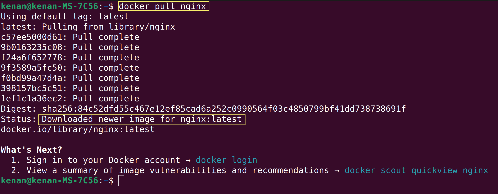

##### Провеhbk наличие докер-образа через `docker images`.

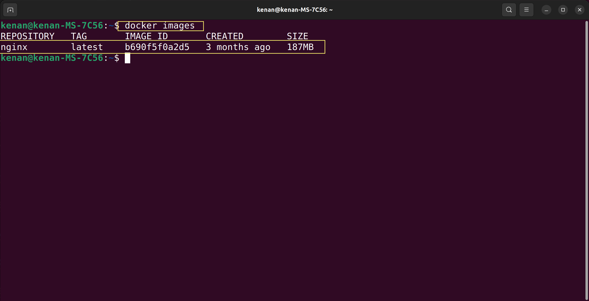

##### Запусти докер-образ через `docker run -d [image_id|repository]`.

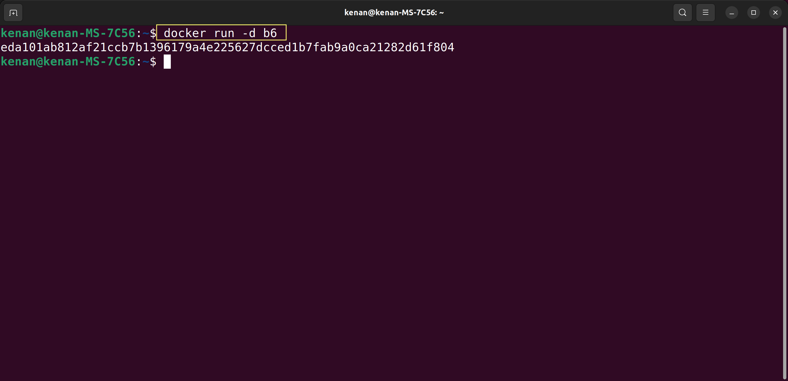

  >  достаточно ввести первые 2 символа ID

##### Проверим, что образ запустился через `docker ps`.

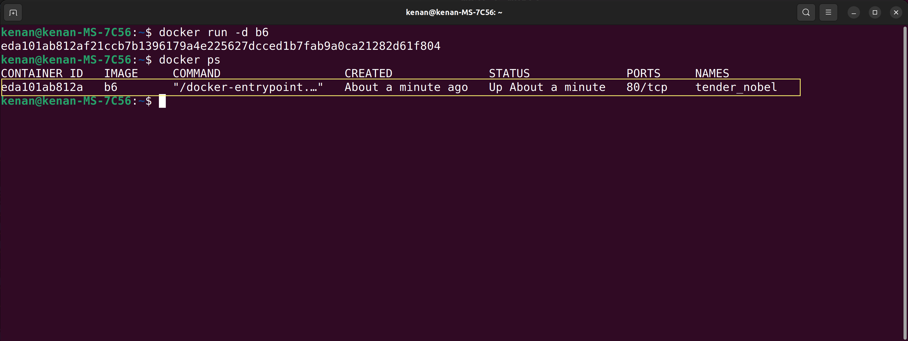

##### Посмотрим информацию о контейнере через `docker inspect [container_id|container_name]`.


 > размер контейнера в параметре SizeRootFs

  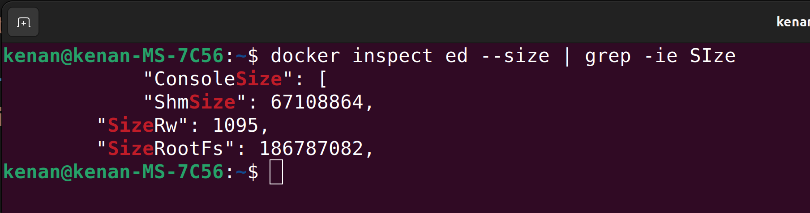

 > список замапленных портов

  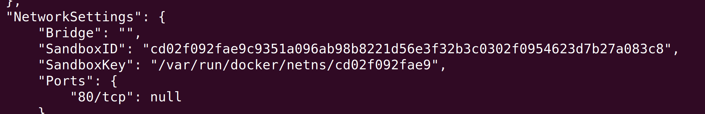
  * контейнер слушает 80 порт, но пока не проброшен хосту

 > ip контейнера

  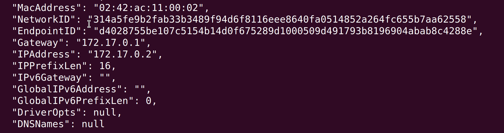
  * 172.17.0.2

##### Остановил докер образ через `docker stop [container_id|container_name]` и Проверил, что образ остановился через `docker ps`.

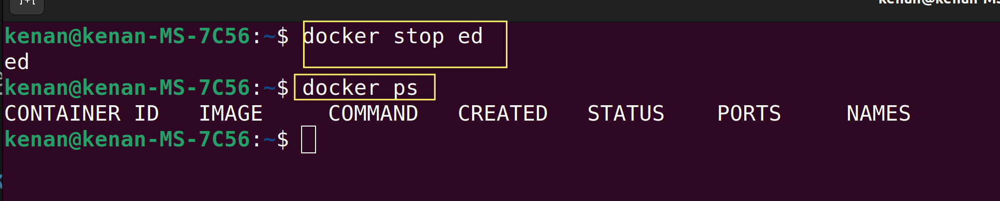

##### Запусти докер с портами 80 и 443 в контейнере, замапленными на такие же порты на локальной машине, через команду *run*.

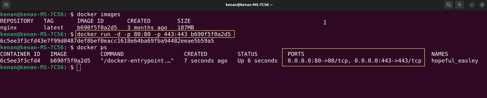

##### Проверь, что в браузере по адресу *localhost:80* доступна стартовая страница **nginx**.

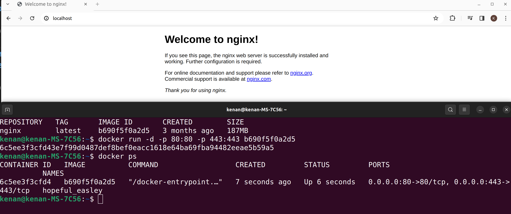

##### Перезапусти докер контейнер через `docker restart [container_id|container_name]`.

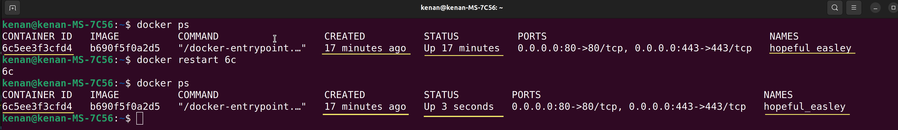

## Part 2. Операции с контейнером

##### Прочитай конфигурационный файл *nginx.conf* внутри докер контейнера через команду *exec*.

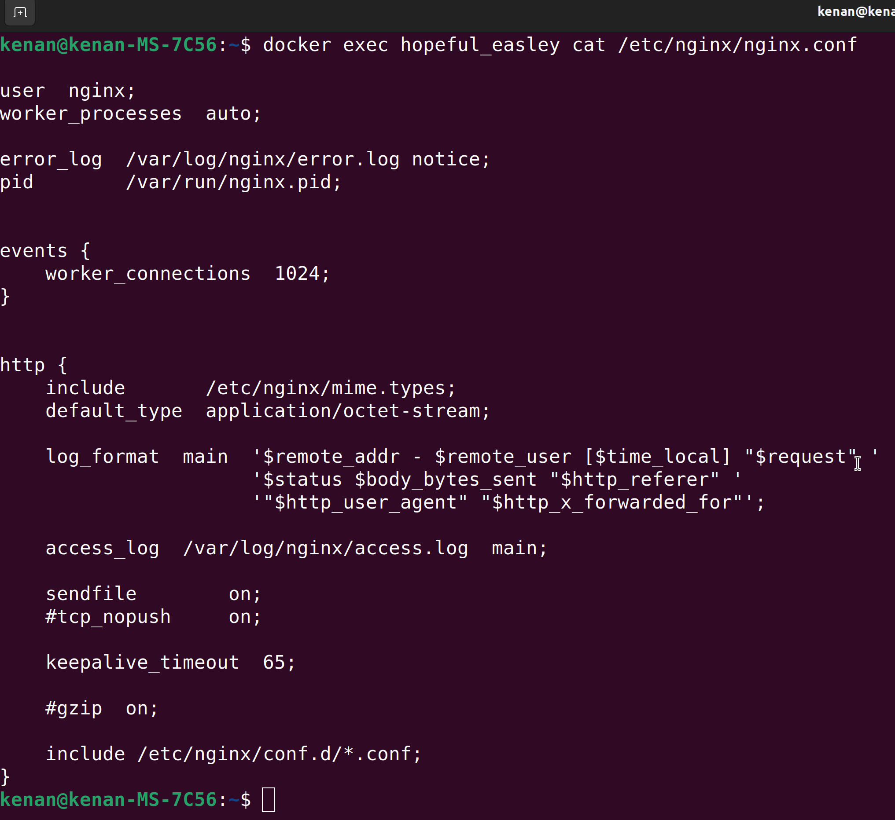

##### Создал на локальной машине файл *nginx.conf*.

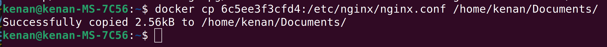

* копируем к себе

##### Настроил в нем по пути */status* отдачу страницы статуса сервера **nginx**.

    user  nginx;
    worker_processes  auto;

    error_log  /var/log/nginx/error.log notice;
    pid        /var/run/nginx.pid;


    events {
        worker_connections  1024;
    }
    http {
        include       /etc/nginx/mime.types;
        default_type  application/octet-stream;

        log_format  main  '$remote_addr - $remote_user [$time_local] "$request" '
                          '$status $body_bytes_sent "$http_referer" '
                          '"$http_user_agent" "$http_x_forwarded_for"';

        access_log  /var/log/nginx/access.log  main;

        sendfile        on;
        #tcp_nopush     on;

        keepalive_timeout  65;

        #gzip  on;

        #include /etc/nginx/conf.d/*.conf;
        server{

        location /status{
        stub_status;
          }
        }

        
    }

 * Добавил блок: 
 
        server{
              location /status{
              stub_status;
                }
        }

##### Скопируй созданный файл *nginx.conf* внутрь докер-образа через команду `docker cp`.

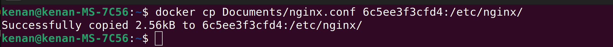

##### Перезапусти **nginx** внутри докер-образа через команду *exec*.

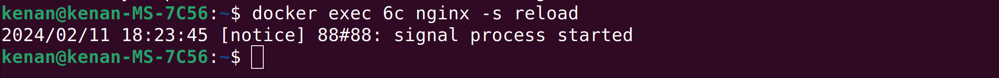

##### Проверь, что по адресу *localhost:80/status* отдается страничка со статусом сервера **nginx**.

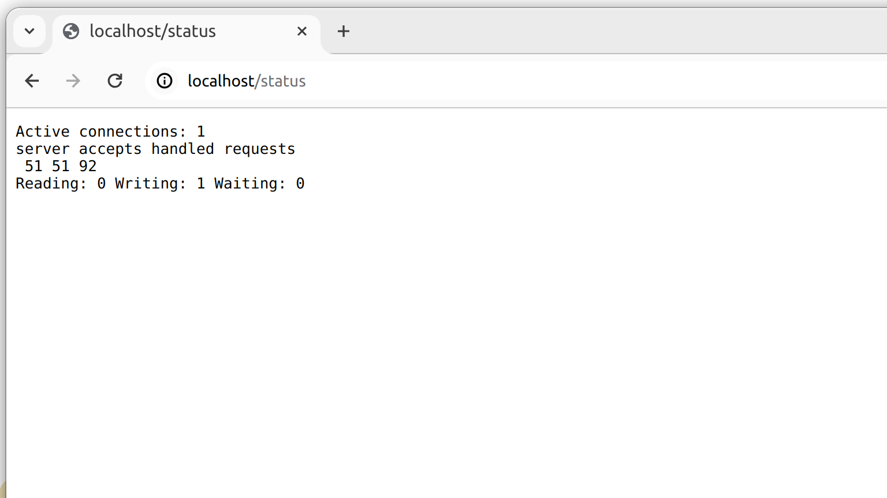

##### Экспортируй контейнер в файл *container.tar* через команду *export*.

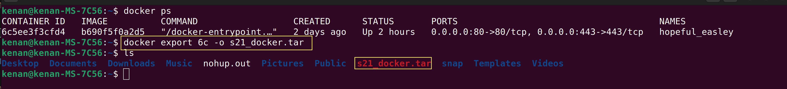      

##### Останови контейнер.

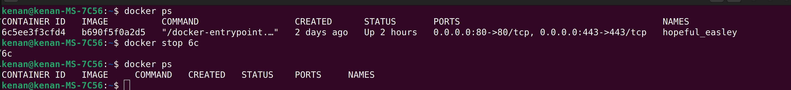

##### Удали образ через `docker rmi [image_id|repository]`, не удаляя перед этим контейнеры.

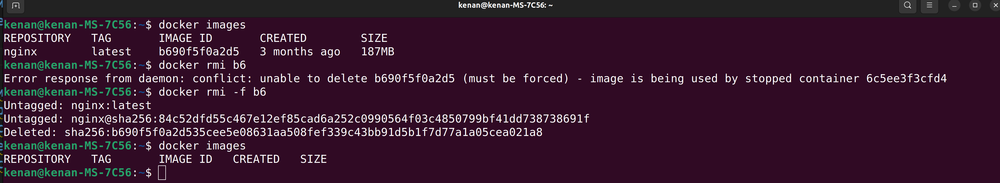

##### Удали остановленный контейнер.

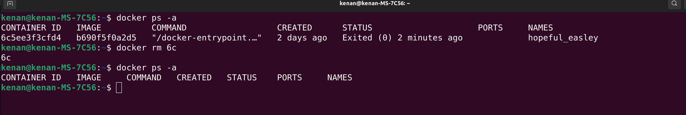

##### Импортируй контейнер обратно через команду *import*.

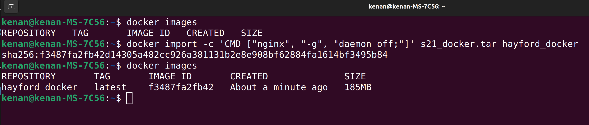
* docker import -c 'CMD ["nginx", "-g", "daemon off;"]' s21_docker_tar [new_name] - импортируем подобным образом, т.к. контейнер не знает точку входа.

##### Запусти импортированный контейнер.

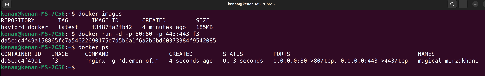

##### Проверь, что по адресу *localhost:80/status* отдается страничка со статусом сервера **nginx**.

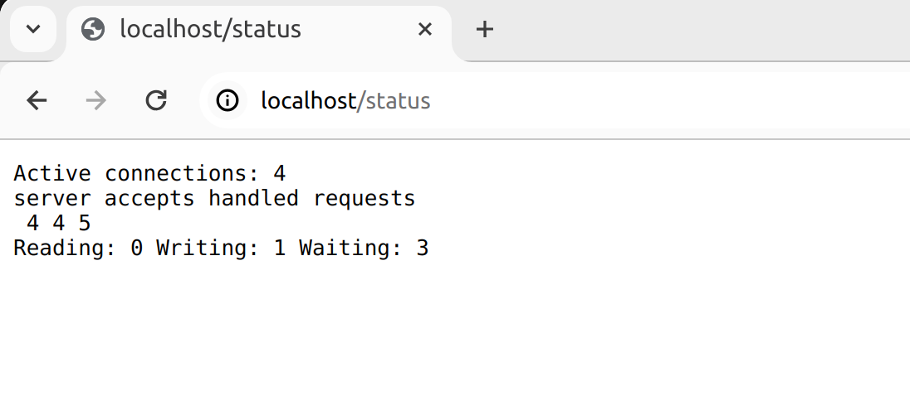


## Part 3. Мини веб-сервер

**== Задание ==**

##### Напиши мини-сервер на **C** и **FastCgi**, который будет возвращать простейшую страничку с надписью `Hello World!`.

    #include <stdio.h>
    #include "fcgi_stdio.h"

    int main() {
      while (FCGI_Accept >= 0) {
        printf("Content-type: text/html\r\n\rHello World!");
      }

      return 0;
    }
#### Запустим контейнер на портах 81

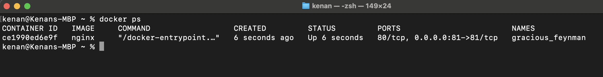

* подготовили короткий bash крипт для запуска и установок библиотеки внтури контейнера

  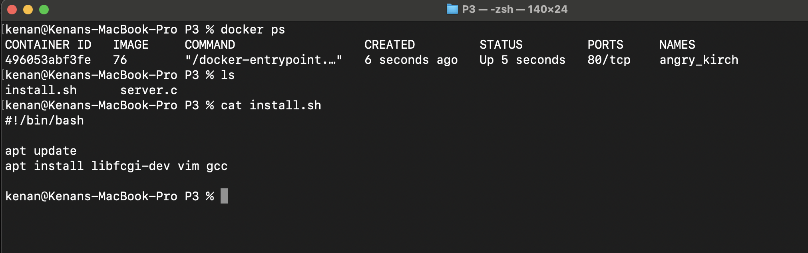

* отправили все в контейнер

  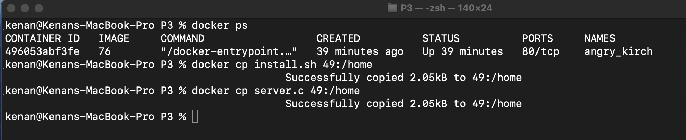

##### Запусти написанный мини-сервер через *spawn-fcgi* на порту 8080.

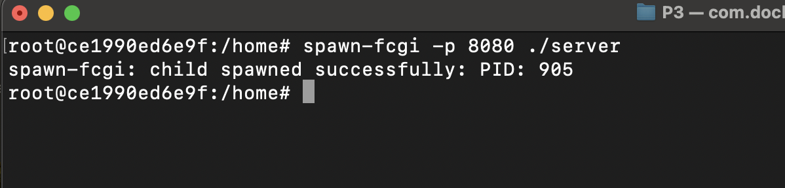

##### Напиши свой *nginx.conf*, который будет проксировать все запросы с 81 порта на *127.0.0.1:8080*.

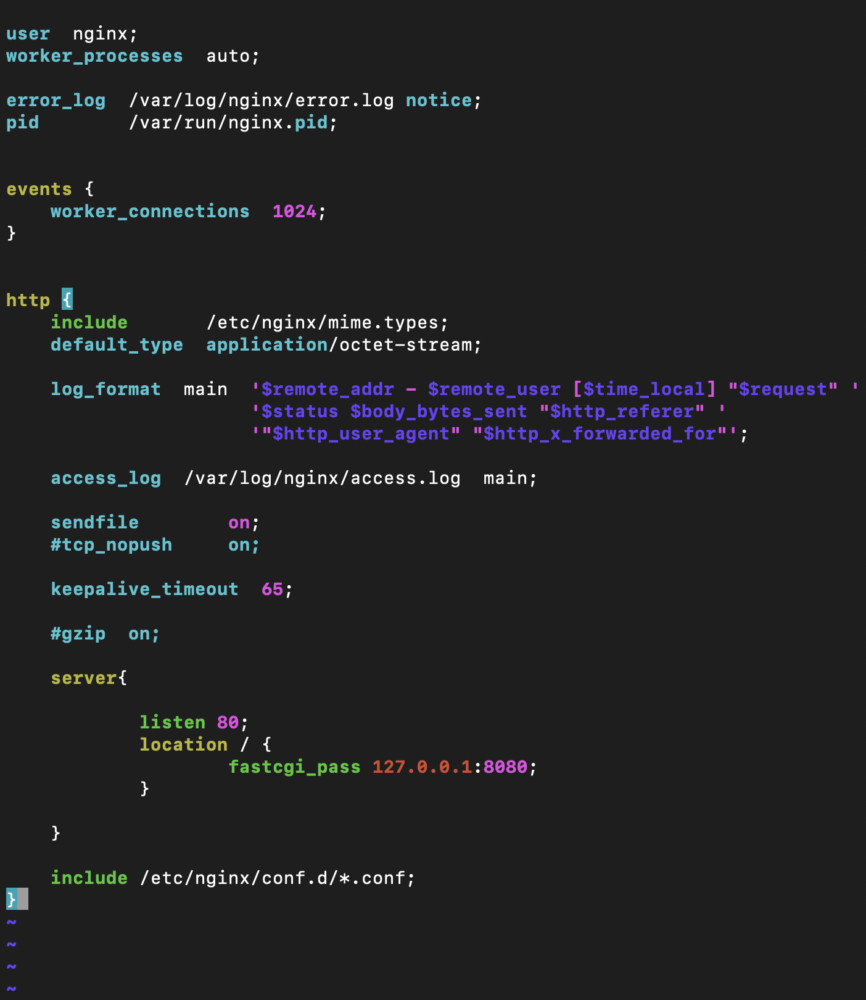

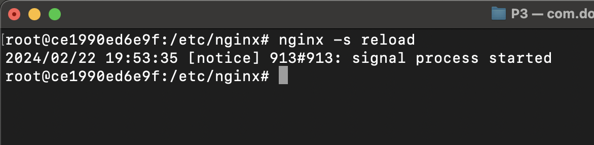

##### Проверь, что в браузере по *localhost:81* отдается написанная тобой страничка.

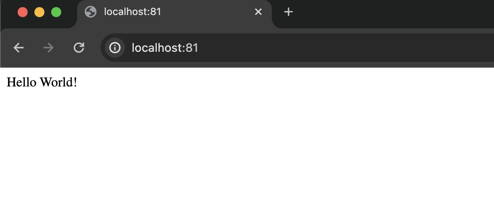

## Part 4. Свой докер

**== Задание ==**

*При написании докер-образа избегай множественных вызовов команд RUN*

#### Напиши свой докер-образ, который:

* Подготовим следующий перечень файлов и их содержание.
  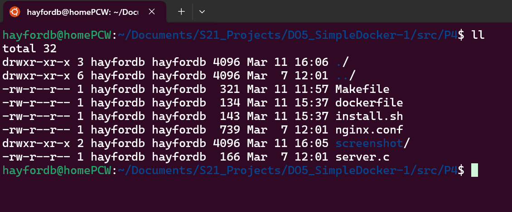

* dockerfile
  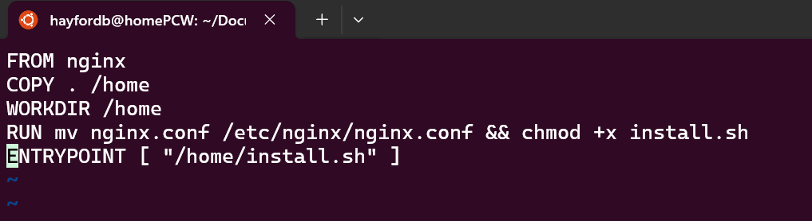

* makefile 
  
  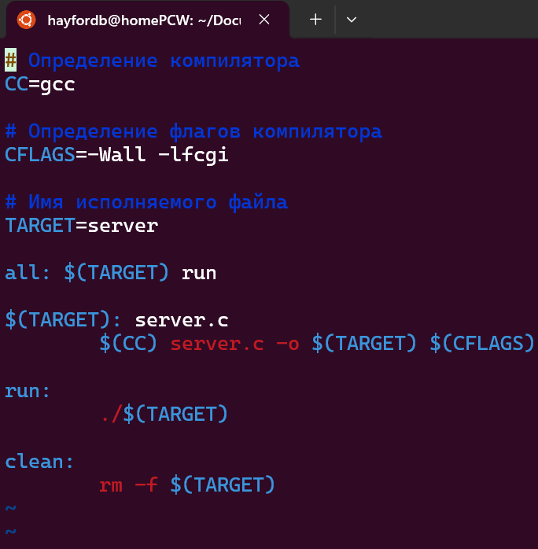

* install.sh
  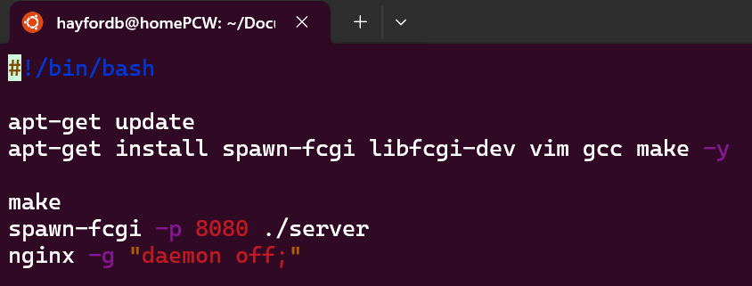

* server.c
  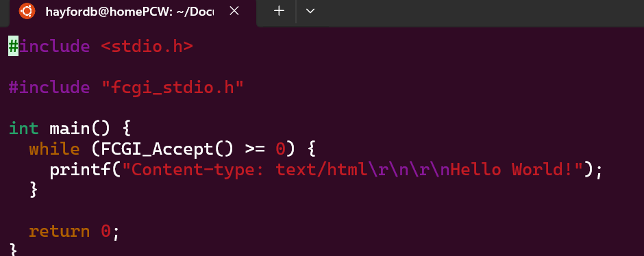

* nginx.conf
  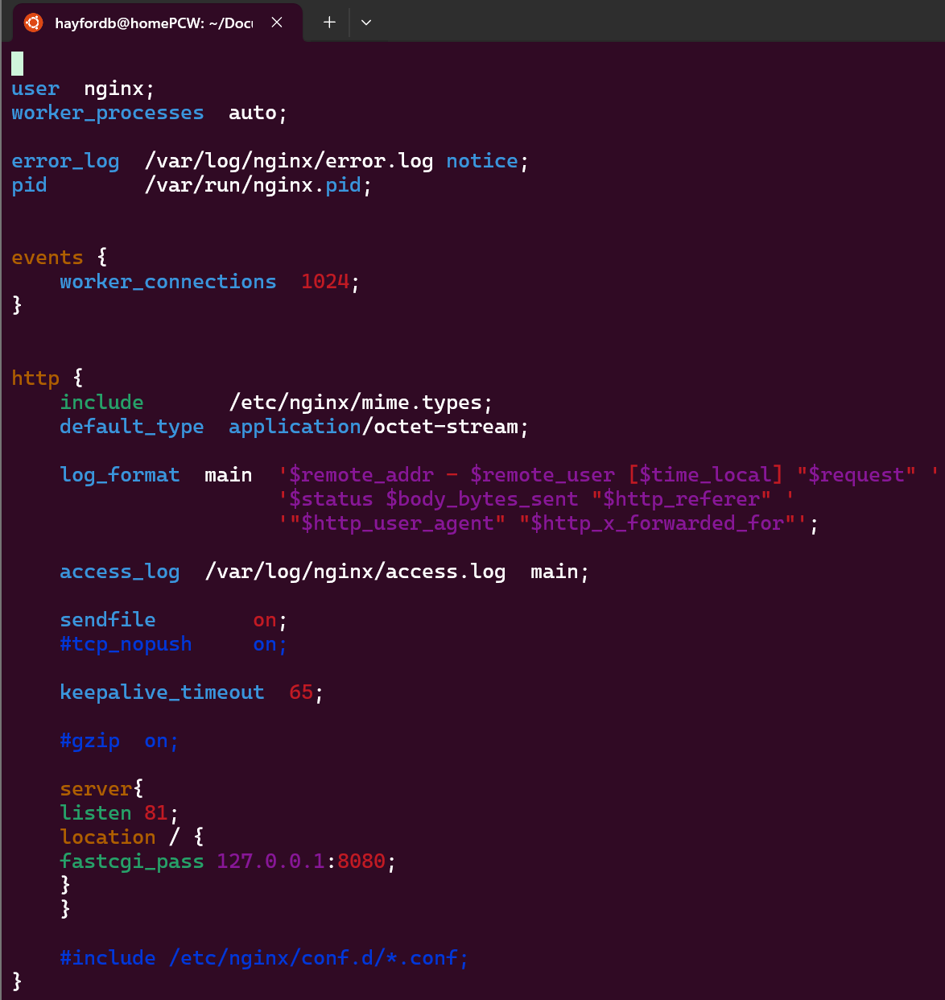

##### Собери написанный докер-образ через `docker build` при этом указав имя и тег.

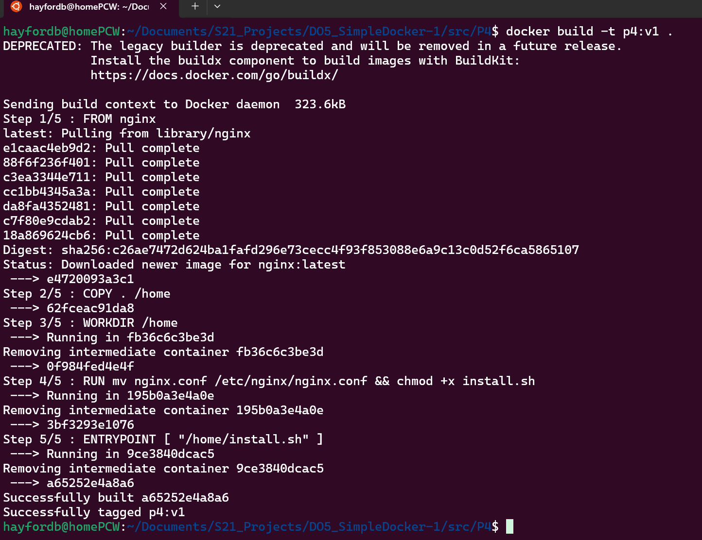

##### Проверь через `docker images`, что все собралось корректно.

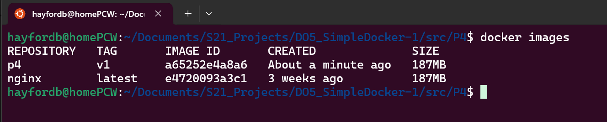

##### Запусти собранный докер-образ с маппингом 81 порта на 80 на локальной машине и маппингом папки *./nginx* внутрь контейнера по адресу, где лежат конфигурационные файлы **nginx**'а (см. [Часть 2](#part-2-операции-с-контейнером)).

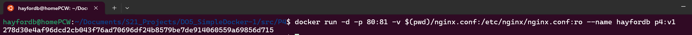

##### Проверь, что по localhost:80 доступна страничка написанного мини сервера.

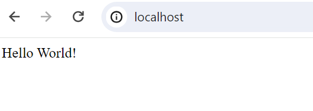

##### Допиши в *./nginx/nginx.conf* проксирование странички */status*, по которой надо отдавать статус сервера **nginx**.

Добавляем
```nginx
http {
    server { # директива настройки сервера
        listen 81;
        location / {
            fastcgi_pass 127.0.0.1:8080;
        }
        location = /status {
            stub_status;
        }
    }
}
```
##### Перезапусти докер-образ.

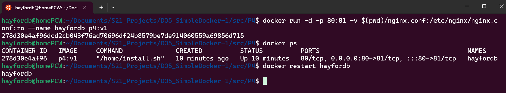

##### Проверь, что теперь по *localhost:80/status* отдается страничка со статусом **nginx**

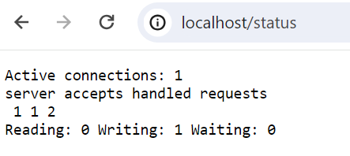

## Part 5. **Dockle**

После написания образа никогда не будет лишним проверить его на безопасность.

**== Задание ==**

##### Просканируй образ из предыдущего задания через `dockle [image_id|repository]`.

* Для начала скачаем и установим утилиту Dockle:

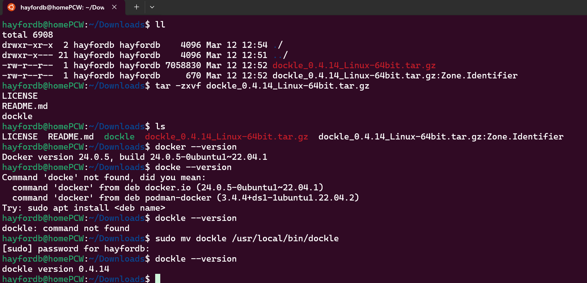

##### Исправь образ так, чтобы при проверке через **dockle** не было ошибок и предупреждений.

* переписаны dockerfile и build.sh

## Part 6. Базовый **Docker Compose**

Вот ты и закончил свою разминку. А хотя погоди...
Почему бы не поэкспериментировать с развёртыванием проекта, состоящего сразу из нескольких докер-образов?

**== Задание ==**

##### Напиши файл *docker-compose.yml*, с помощью которого:
##### 1) Подними докер-контейнер из [Части 5](#part-5-инструмент-dockle) _(он должен работать в локальной сети, т.е. не нужно использовать инструкцию **EXPOSE** и мапить порты на локальную машину)_.
##### 2) Подними докер-контейнер с **nginx**, который будет проксировать все запросы с 8080 порта на 81 порт первого контейнера.
##### Замапь 8080 порт второго контейнера на 80 порт локальной машины.

##### Останови все запущенные контейнеры.
##### Собери и запусти проект с помощью команд `docker-compose build` и `docker-compose up`.

**== Опишу действия ниже ==**

## 1. Подготовим docker-compose.yml

   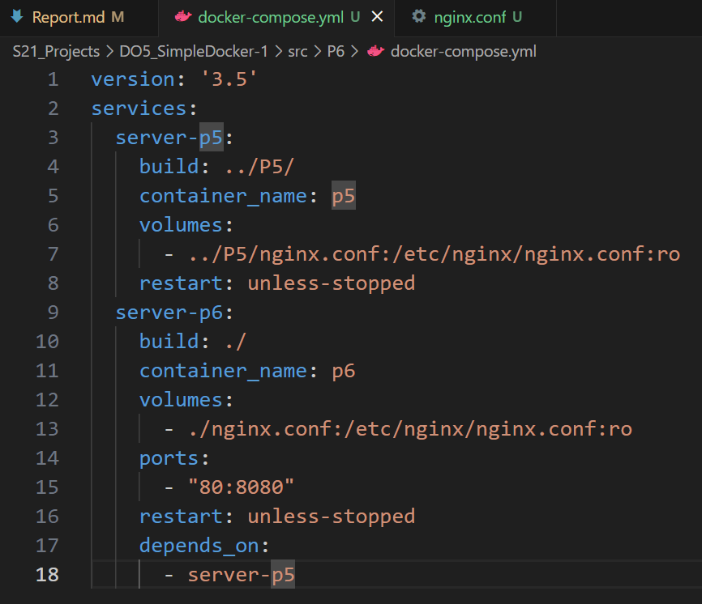

## 2. Опишем nginx.conf для 2-ой машины, которая проксирует трафик:

   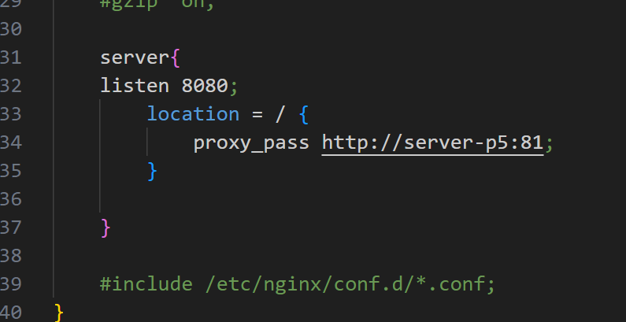

## 3. Опишем простой dockerfile для 2-ой машины:

   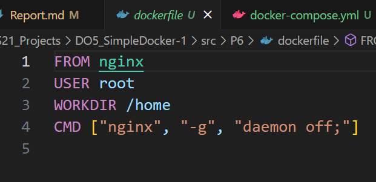

## Собери и запусти проект с помощью команд `docker-compose build` и `docker-compose up`.

   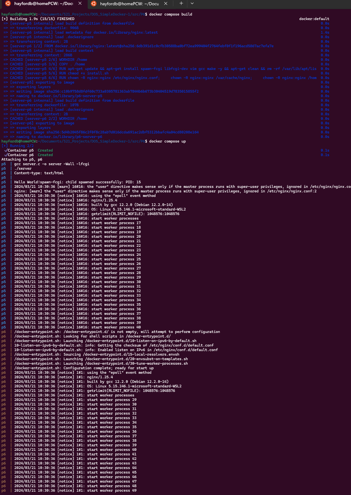